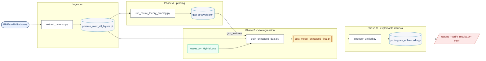

# pipeline-map — Thesis Pipeline Cartographer

Trace the real data/experiment flow in this repo and render it as Mermaid diagrams
via the **claude-mermaid** MCP server (tools `mermaid_preview`, `mermaid_save`).

**IRON RULE — this skill is read-only and structural.** It documents *what the code
does and what feeds what*. It does **not** run training, edit scripts, or report
result numbers. If a number must appear on a diagram (e.g. a labelled best score),
it must come from `CLAUDE.md` §4 Canonical Values or a `reports/run_logs/*.log` — never
invented. Prefer structure (arrows, artifacts) over metrics.

---

## When to use
User asks to map / diagram / draw the pipeline, understand how the phases connect,
what artifact feeds which script, or wants a publication-style flow figure of the system.

## Modes
- **overview** (default) — one cross-phase diagram: ingestion → A → B → C → reporting.
- **phase A|B|C** — detailed diagram of a single phase (scripts ↔ artifacts ↔ models).
- **subsystem** — a named slice, e.g. "the ablation family in Phase B" or
  "Phase C retrieval index build/query symmetry".

Ask which mode only if the request is ambiguous; otherwise default to **overview**.

---

## Procedure

1. **Confirm scope** (mode above). Default = overview.

2. **Trace from source, do not trust this file's snapshot blindly.** The map below is a
   starting skeleton; verify against the live tree before drawing, because scripts change:
   ```bash
   cd MERT/ssl_scripts
   grep -REn "argparse|add_argument|torch.save|torch.load|np.save|np.load|json.dump|\.pt|\.npy|\.json" phaseA phaseB phaseC \
     | grep -vE "test_|smoke|__pycache__"
   ```
   Read each entry-point script's header docstring (they document inputs/outputs) plus its
   `main()` / arg defaults. Resolve every `torch.load/np.load` (an *input edge*) and every
   `torch.save/np.save/json.dump` (an *output edge*).

3. **Classify each node** and use a consistent shape/class:
   - **Dataset / raw audio** — stadium `([ ])`, class `data`.
   - **Cached tensor / embedding artifact** (`*.pt`, `*.npy`) — cylinder `[( )]`, class `artifact`.
   - **Script / entry point** (`*.py`) — rectangle `[ ]`, class `script`.
   - **Model / loss definition module** — rounded `( )`, class `model`.
   - **Checkpoint** (`best_model_*.pt`, `*_final.pt`) — subroutine `[[ ]]`, class `ckpt`.
   - **Report / log / figure output** — parallelogram `[/ /]`, class `report`.
   Wrap each phase in a `subgraph`. Label edges with the filename that crosses them.

4. **Render with the MCP**, then **save** to the repo:
   - Call `mermaid_preview` with the diagram, `theme:"neutral"`, `format:"svg"`. Keep the
     returned `preview_id`.
   - Iterate on the diagram in the same `preview_id` until correct.
   - Call `mermaid_save` with that `preview_id`, `format:"png"` (and again `svg`) to
     `reports/diagrams/pipeline_<mode>.png` / `.svg`. Create `reports/diagrams/` if absent.
   - Also write the raw Mermaid source to `reports/diagrams/pipeline_<mode>.mmd` so it
     renders anywhere without the MCP.

5. **Report back** tersely: where the files were saved, and any pipeline facts that
   surprised you during the trace (orphan artifacts, scripts with no consumer, a checkpoint
   nothing loads). Do not claim a result number; this is a structure map.

---

## Known structure (skeleton — verify in step 2 before trusting)

Paths are relative to `MERT/ssl_scripts/`.

**Ingestion** — PMEmo2019 audio `/datasets/emotions/PMEmo2019/chorus` →
- `extract_pmemo.py` (MERT-v1-330M @24kHz, all layers) → `phaseB/pmemo_mert_all_layers.pt`
- `extract_pmemo_wav2vec.py` (wav2vec2-base) → `phaseB/pmemo_wav2vec_all_layers.pt`
- `extract_pmemo_melspec.py` → `phaseB/pmemo_melspec.pt`
- (legacy single-pooled file `pmemo_mert_embeddings.pt` used by `probe_key/tempo.py`)

**Phase A — music-theory probing**
- `extract_music_theory.py` → `phaseA/data/pmemo_music_theory.pt`
- `run_music_theory_probing.py` (reads MERT all-layers + theory) →
  `music_theory_probing_results.json` + `gap_analysis.json` (**gap_features drives Phase B**)
- `probe_key.py`, `probe_tempo.py`, `visualize_embeddings.py` → JSON + t-SNE/cluster PNGs

**Phase B — V-A regression + ablations** (loss: `losses.py` HybridLoss = MSE+CCC+Rank+SupCR)
- `train_enhanced_dual.py` (MERT+w2v+theory, gap-conditional; `models_enhanced.py`) →
  `best_model_enhanced_fold{1..5}.pt` (+ `best_model_enhanced_final.pt`)
- `mainB_triple.py --encoder triple|spec_only` (MERT+w2v+melspec; `models_triple.py`) →
  `best_model_{triple,spec_only}_fold*.pt`
- `mainB.py --model baseline|hybrid` (`models.py`) → `best_model.pt`
- `train_protopnet.py` (`models_protopnet.py`) → `protopnet_final.pt`
- `eval_*.py` (last-layer, mixup, quadrant-CE, retrieval, imbalance, key-encoding, silhouette,
  mel-only, wav2vec-only, …) → `logs/` + `reports/run_logs/*.log`
- `layer_weights*.npy` learned fusion weights

**Phase C — explainable retrieval / prototypes**
- `encoder_unified.py` loads `../phaseB/best_model_enhanced_final.pt` (build==query symmetry)
- `build_index_unified.py --mode build|query` → `prototypes_enhanced.npy`
  (siblings `prototypes.npy` = MERT-only, `prototypes_dual.npy` = dual-SSL)
- `retriever.py`/`retrieval.py`, `explainer.py`, `music_theory_annotator.py`,
  `protopnet_readout.py`, `evaluate_latent_space.py`
- `export_artifacts.py`, `export_explanations.py`, `make_pipeline_figure.py` → `artifacts/*.png`

**Reporting (cross-cutting)** — `reports/run_logs/*.log` → `verify_results.py` (audit gate) →
`reports/0X_*.md` + `generate_report_v3.py` → PDF; `JOURNEY.md` diary.

---

## Reference: minimal overview Mermaid skeleton

Start from this and fill in from the live trace; do not ship it unverified.



---

## Output location
`reports/diagrams/pipeline_<mode>.{mmd,svg,png}` (create the dir if missing).

## Environment notes
- claude-mermaid MCP is registered in repo `.mcp.json` (command `npx -y claude-mermaid`).
  Verify with `/mcp` — you should see `mermaid`. The binary is also installed user-level at
  `~/.npm-global/bin/claude-mermaid` (v1.6.4).
- **Over SSH:** `mermaid_save` writes files headlessly and works fine. The *live browser
  preview* opens on `http://localhost:3737` on the server — to view it locally, SSH with
  port forwarding: `ssh -L 3737:localhost:3737 <user>@<server>`. If you only need the saved
  files, ignore the preview URL.
- Keep diagrams structural; never let a generated label contradict `CLAUDE.md` §4.
